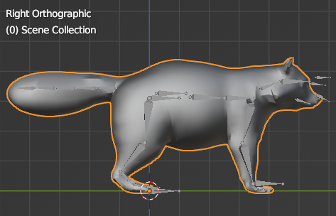
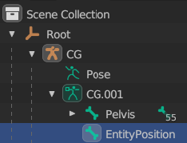
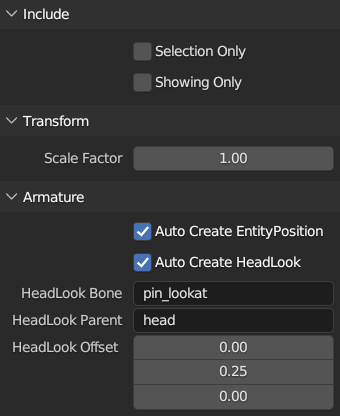
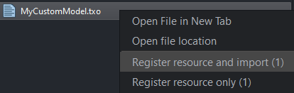
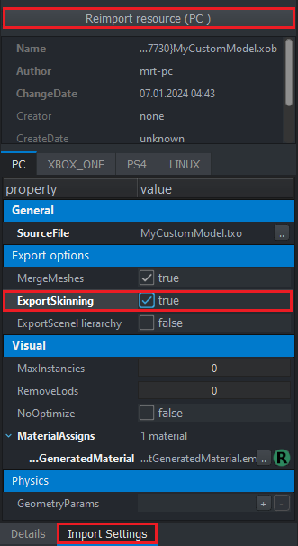

# DayZ Animation Tools
This project aims to provide a better and more correct workflow for modding custom entities and animations that interact with the enfusion system for DayZ using blender. Its use generally consists of the import/export of txo/txa files, which are the human-readable asset files used for 3D models and animations for DayZ's version of the enfusion engine.

Note: the binary xob/anm format for DayZ objects/animations will not be handled in any way by this addon because it violates Bohemia Interactive's terms of service for DayZ

## Importing 3D Models

1. Import a 3D model that you want to use for DayZ

2. Orient the skeleton (or model if there is no skeleton) such that it faces the positive y direction, an easy way to check this is to go to the right orthographic view (numpad 3) and make sure its front faces your right

	

3. If you are trying to make an entity that uses root motion to move in-game, you will need to add an empty (unweighted) bone "EntityPosition" as a root bone (so it will have no parent), don't transform it away from the armature's origin

	

4. Start exporting the model `File` > `Export` > `DayZ Source Model (.txo)` (Note: this will apply all transforms of all relevent objects, so make sure you have a backup of the model)

	

5. Finish exporting the model to somewhere on your P drive

6. Open `DayZ Tools` > `Workbench`

7. Find your model and right click on it, then click `Register resource and import`

	

8. Find its generated xob file, then in the right panel, click `Import Settings` > `ExportSkinning = true` > `Reimport resource (PC)`

	

9. Find `YourModelName_skeleton.xml` and copy everything in it, then find `P:/DZ/anims/cfg/skeletons.anim.xml`, and paste everything **AFTER** `<skeletons version="1.0">` (This will not affect your final mod, this is only so you can preview animations for your model's skeleton in your workbench instance)

## Animations
- The "Add Survivor IK Bones" option is should only be used for designated as ik animations, otherwise these bones ("RightHandOrigin" and "LeftHandOrigin") should be deleted (if already added)
- The "Event Manager" (accessed with 'n') can be used to place events on frames as an alternative to the DayZ Tools' Workbench Animation Editor

## Contribution
- Thanks to Hunterz for providing practical use cases for a tool like this, and testing to make sure everything is working acceptably
- Pull requests and issues are accepted

## Installation
Prerequisite: Blender version 2.8 or greater is required
1. Be sure to [uninstall any old version](#Uninstallation) first, including restarting Blender afterward

2. Download the latest add-on zip file from the [repository releases page](https://github.com/Mrtea101/DayzAnimationTools/releases)

3. Navigate to the add-ons menu in Blender at `Edit` > `Preferences` > `Add-ons`

4. Click `Install`

5. Select the **zip file** downloaded above and click `Install Add-on` _(Do not unzip the file!)_

6. Find the `Import-Export: DayzAnimationTools` add-on in the list, and ensure the checkbox next to its name is checked

## Uninstallation
1. Navigate to the add-ons menu in Blender at `Edit` > `Preferences` > `Add-ons`

2. In the top-right search window, search for `DayzAnimationTools`

3. If `DayzAnimationTools` is present, click the left arrow to expand it and click `Remove` to uninstall it

4. Restart Blender after uninstalling

## Todo/Unfinished
1. Custom Property Manager (only if necessary)
2. Survivor IK: support for "pole vector" from additional IK bones (LeftForeArmDirection, LeftForeArmDirectionOrigin, RightForeArmDirection, RightForeArmDirectionOrigin)